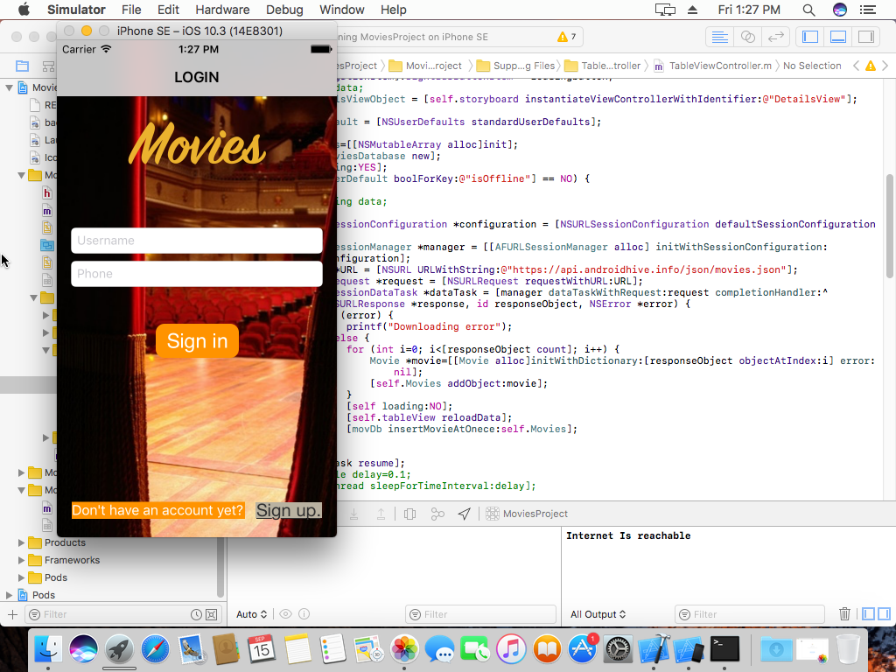
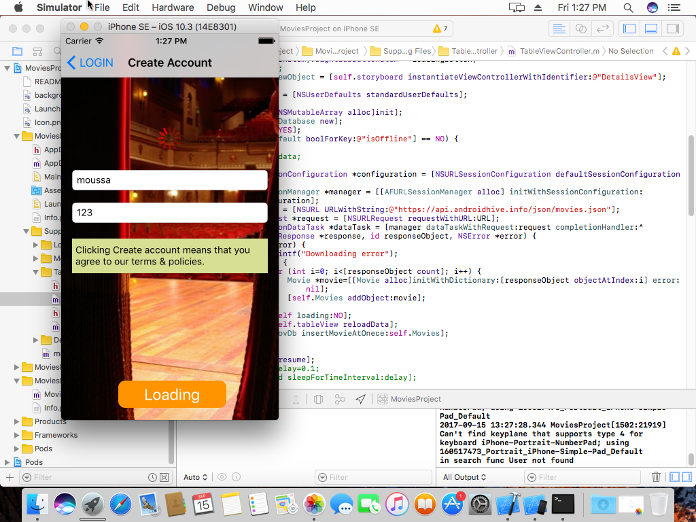
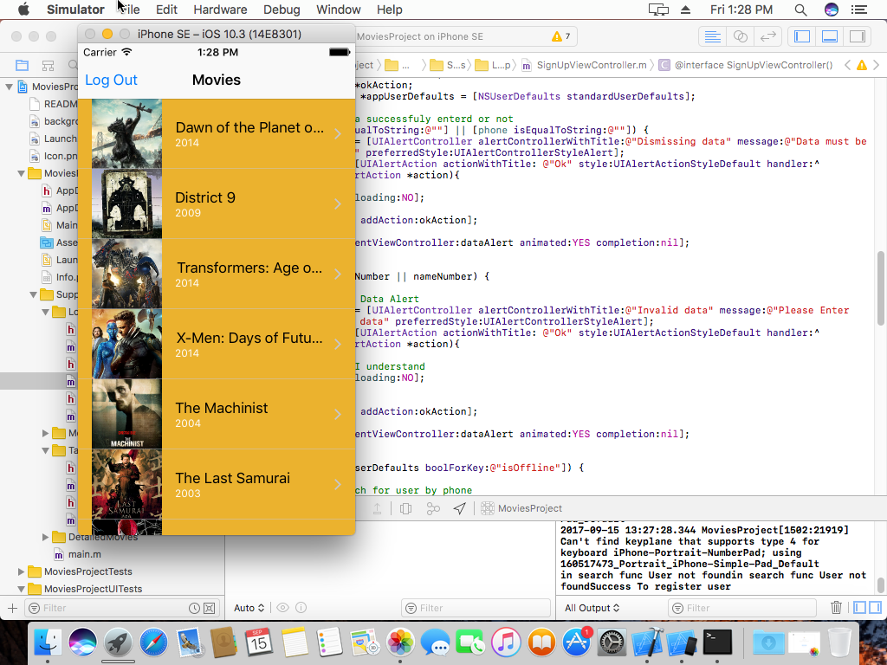
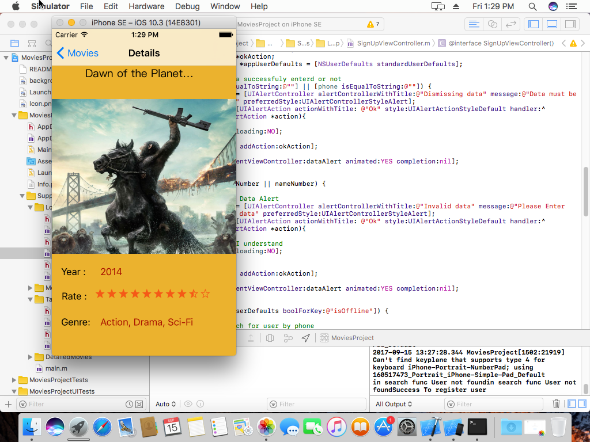
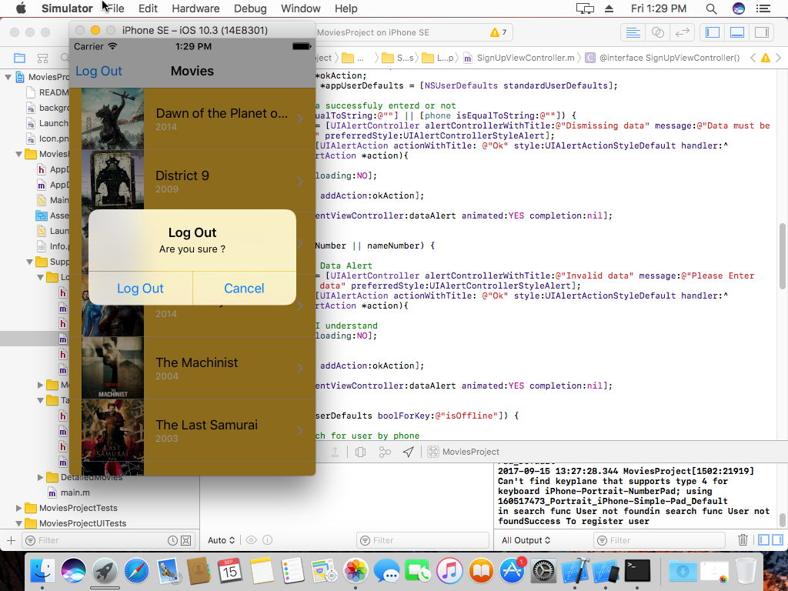
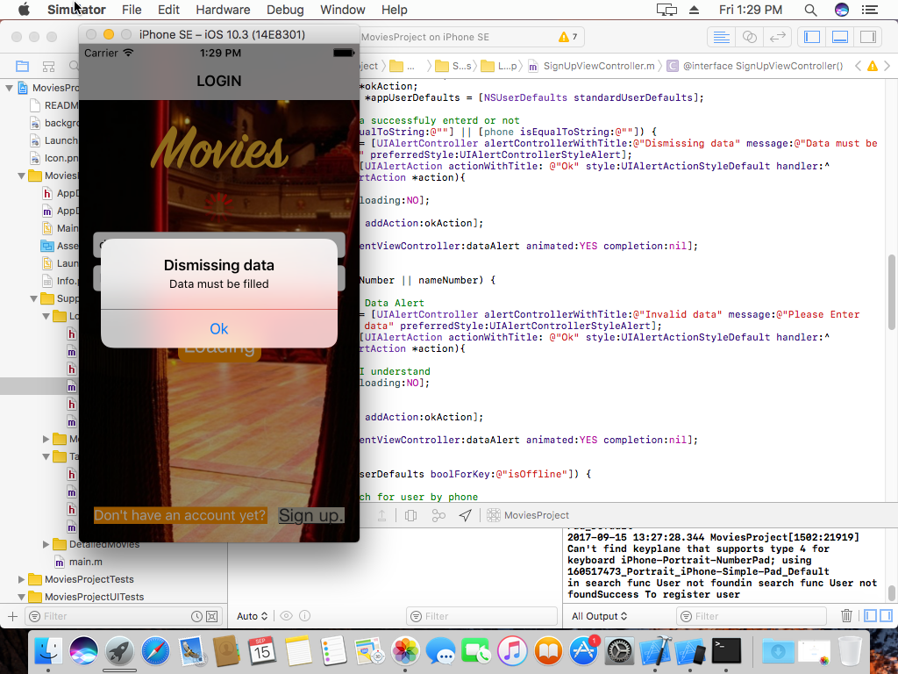

# ITIMoviesProject-iOS

Befor  Run , You must install frameworks which be used in .
To install framworks :
BY Pod : 
  1-Go to Project dirctory by terminal ,for example cd Desktop/ITIMoviesProject-iOS/.
  2-pod setup.
  3-pod init.
  4-got to podfile which has been installed in project and open it.
  5- copy lines  : 
    pod 'AFNetworking', '~> 3.0'    
    pod 'JSONModel'
    pod 'SDWebImage'
    pod 'HCSStarRatingView'
    
  6-paste in podfile after target line
